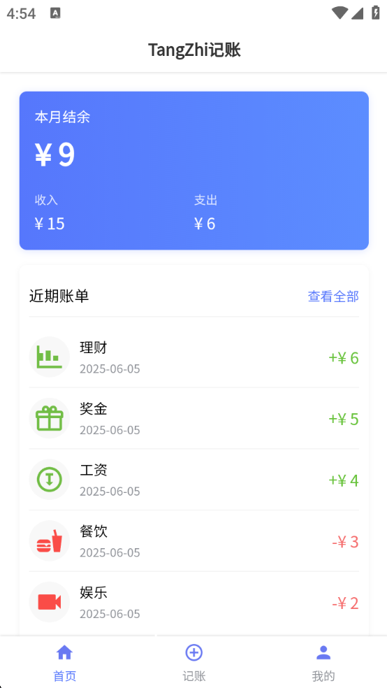
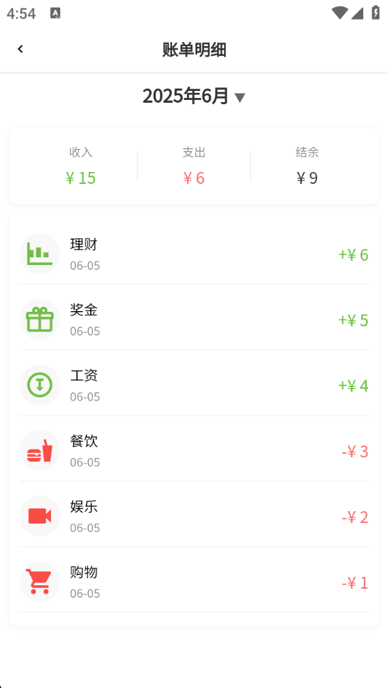
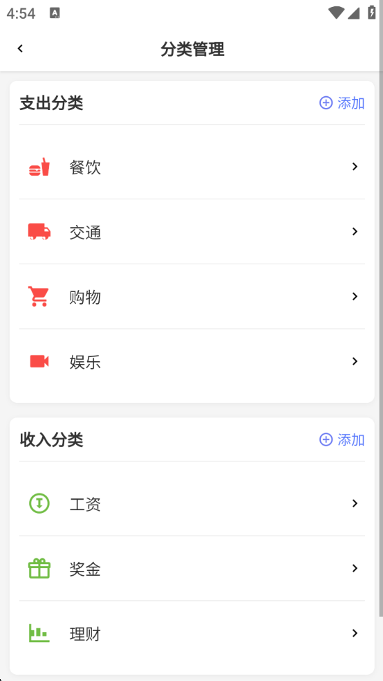

# TangZhi记账 (TangZhi Bookkeeping)

<p align="center">
  
</p>

<p align="center">一款简洁高效的个人记账应用</p>

## 📝 项目介绍

唐志记账是一款专为个人财务管理设计的移动端记账应用，采用 uni-app 框架开发，支持多平台部署。应用界面简洁直观，功能丰富实用，帮助用户轻松记录日常收支，科学管理个人财务。

## ✨ 主要功能

### 📊 收支记录
- 支持收入、支出、转账等多种交易类型
- 自定义分类管理，支持图标选择
- 详细的交易记录

### 📈 数据统计
- 月度收支统计

## 🛠️ 技术栈

- 前端框架：uni-app
- 数据存储：SQLite
- UI组件：自定义组件
- 图标系统：SVG图标

## 📱 应用截图

<div align="center">
  
  
  
</div>

## 🚀 快速开始

### 环境要求
- HBuilderX 3.0+
- Node.js 12.0+

### 安装步骤

1. 克隆项目到本地
```bash
git clone https://github.com/TangZhiZzz/TangZhi-Bookkeeping.git
```

2. 使用HBuilderX打开项目


3. 运行项目
   - 在HBuilderX中选择运行到浏览器或模拟器

## 📋 数据库结构

应用使用SQLite数据库存储数据，主要表结构包括：

- `categories`: 分类信息表，记录收支分类信息
- `transactions`: 交易记录表，记录所有收入、支出和转账交易

## 🎨 自定义图标

应用使用SVG图标系统，支持自定义颜色和大小。图标文件存放在 `static/icons` 目录下，可以根据需要添加或修改图标。

## 📄 许可证

[MIT](LICENSE)

## 👨‍💻 关于作者

Tangzhi记账由热爱技术、注重用户体验的开发者精心打造，旨在提供一款简洁高效的个人财务管理工具。

## 🤝 贡献指南

欢迎提交问题和功能请求，或直接提交PR参与项目开发。

---

<p align="center">用心记录，明智规划 - 唐志记账</p>